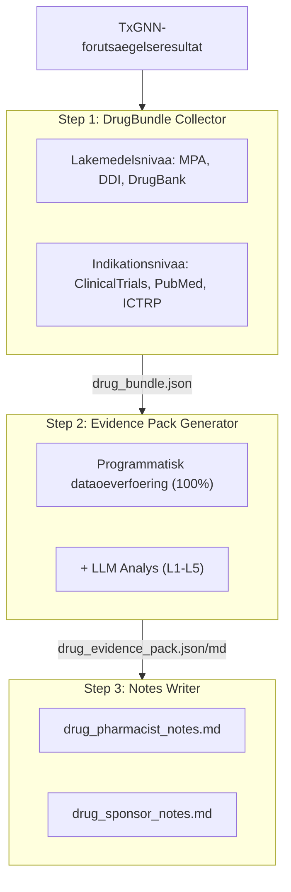
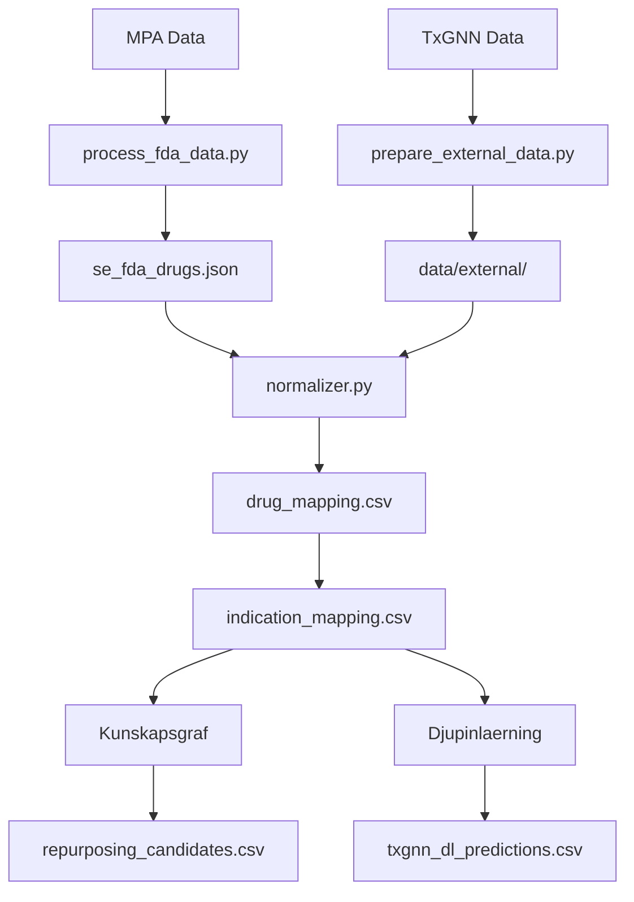

# SETxGNN - Sverige: Lakemedelsrepositionering

[](https://setxgnn.yao.care)
[](https://opensource.org/licenses/MIT)

Forutsaegelser foer lakemedelsrepositionering av MPA-godkaenda lakemedel (Sweden) med TxGNN-modellen.

## Ansvarsfriskrivning

- Resultaten av detta projekt aer endast foer forskningsaendamaal och utgoer inte medicinsk raadgivning.
- Kandidater foer lakemedelsrepositionering kraever klinisk validering foere tillaempning.

## Projektoeversikt

### Rapportstatistik

| Element | Antal |
|------|------|
| **Lakemedelsrapporter** | 108 |
| **Totala forutsaegelser** | 3,672,147 |
| **Unika lakemedel** | 152 |
| **Unika indikationer** | 16,564 |
| **DDI-data** | 302,516 |
| **DFI-data** | 857 |
| **DHI-data** | 35 |
| **DDSI-data** | 8,359 |
| **FHIR-resurser** | 108 MK / 556 CUD |

### Foerdelning av evidensnivaaer

| Evidensnivaa | Antal rapporter | Beskrivning |
|---------|-------|------|
| **L1** | 0 | Flera Fas 3 RCT:er |
| **L2** | 0 | Enskild RCT eller flera Fas 2 |
| **L3** | 0 | Observationsstudier |
| **L4** | 0 | Prekliniska / mekanistiska studier |
| **L5** | 108 | Endast beraekningsbaserad forutsaegelse |

### Per kaella

| Kaella | Forutsaegelser |
|------|------|
| DL | 3,671,591 |
| KG + DL | 485 |
| KG | 71 |

### Per tillit

| Tillit | Forutsaegelser |
|------|------|
| very_high | 386 |
| high | 174,589 |
| medium | 363,223 |
| low | 3,133,949 |

---

## Forutsaegelsemetoder

| Metod | Hastighet | Noggrannhet | Krav |
|------|------|--------|----------|
| Kunskapsgraf | Snabb (sekunder) | Laegre | Inga speciella krav |
| Djupinlaerning | Laangsam (timmar) | Hoegre | Conda + PyTorch + DGL |

### Kunskapsgraf-metod

```bash
uv run python scripts/run_kg_prediction.py
```

| Maetvaerde | Vaerde |
|------|------|
| MPA Totalt antal lakemedel | 14,492 |
| Kartlagda till DrugBank | 2,175 (15.0%) |
| Repositioneringskandidater | 556 |

### Djupinlaerning-metod

```bash
conda activate txgnn
PYTHONPATH=src python -m setxgnn.predict.txgnn_model
```

| Maetvaerde | Vaerde |
|------|------|
| Totala DL-forutsaegelser | 298,386 |
| Unika lakemedel | 152 |
| Unika indikationer | 16,564 |

### Poaengtolkning

TxGNN-poaengen representerar modellens tillit till ett lakemedels-sjukdomspar, med ett intervall fraan 0 till 1.

| Troeskelvaerde | Betydelse |
|-----|------|
| >= 0.9 | Mycket hoeg tillit |
| >= 0.7 | Hoeg tillit |
| >= 0.5 | Maattlig tillit |

#### Poaengfoerdelning

| Troeskelvaerde | Betydelse |
|-----|------|
| ≥ 0.9999 | Extremt hoegt foertroende, modellens mest saekra foeruts aegelser |
| ≥ 0.99 | Mycket hoegt foertroende, vaert att prioritera foer validering |
| ≥ 0.9 | Hoegt foertroende |
| ≥ 0.5 | Maattligt foertroende (sigmoid-beslutsgraens) |

#### Definitioner av evidensnivaaer

| Nivaa | Definition | Klinisk betydelse |
|-----|------|---------|
| L1 | Fas 3 RCT eller systematisk oeeversikt | Kan stoedja klinisk anvaendning |
| L2 | Fas 2 RCT | Kan oevervagas foer anvaendning |
| L3 | Fas 1 eller observationsstudie | Kraever ytterligare utvaerdering |
| L4 | Fallrapport eller preklinisk forskning | AEnnu inte rekommenderat |
| L5 | Endast beraekningsbaserad foeruts aegelse, ingen klinisk evidens | Kraever ytterligare forskning |

#### Viktiga paaminnelser

1. **Hoega poaeng garanterar inte klinisk effektivitet: TxGNN-poaeng aer kunskapsgrafikbaserade foeruts aegelser som kraever klinisk validering.**
2. **Laaga poaeng betyder inte ineffektivt: modellen kanske inte har laert sig vissa samband.**
3. **Rekommenderas att anvaenda med valideringspipeline: anvaend detta projekts verktyg foer att granska kliniska studier, litteratur och andra bevis.**

### Valideringspipeline



---

## Snabbstart

### Steg 1: Ladda ner data

| Fil | Nedladdning |
|------|------|
| MPA Data | [Läkemedelsverket - Läkemedelsregister](https://www.lakemedelsverket.se/api/lmfrest/exportmedprodcsv) |
| node.csv | [Harvard Dataverse](https://dataverse.harvard.edu/api/access/datafile/7144482) |
| kg.csv | [Harvard Dataverse](https://dataverse.harvard.edu/api/access/datafile/7144484) |
| edges.csv | [Harvard Dataverse](https://dataverse.harvard.edu/api/access/datafile/7144483) |
| model_ckpt.zip | [Google Drive](https://drive.google.com/uc?id=1fxTFkjo2jvmz9k6vesDbCeucQjGRojLj) |

### Steg 2: Installera beroenden

```bash
uv sync
```

### Steg 3: Behandla lakemedelsdata

```bash
uv run python scripts/process_fda_data.py
```

### Steg 4: Foebereda vokabulaerdata

```bash
uv run python scripts/prepare_external_data.py
```

### Steg 5: Koer kunskapsgraf-forutsaegelse

```bash
uv run python scripts/run_kg_prediction.py
```

### Steg 6: Konfigurera djupinlaerningsmiljoe

```bash
conda create -n txgnn python=3.11 -y
conda activate txgnn
pip install torch==2.2.2 torchvision==0.17.2
pip install dgl==1.1.3
pip install git+https://github.com/mims-harvard/TxGNN.git
pip install pandas tqdm pyyaml pydantic ogb
```

### Steg 7: Koer djupinlaerning-forutsaegelse

```bash
conda activate txgnn
PYTHONPATH=src python -m setxgnn.predict.txgnn_model
```

---

## Resurser

### TxGNN Kaerna

- [TxGNN Paper](https://www.nature.com/articles/s41591-024-03233-x) - Nature Medicine, 2024
- [TxGNN GitHub](https://github.com/mims-harvard/TxGNN)
- [TxGNN Explorer](http://txgnn.org)

### Datakaellor

| Kategori | Data | Kaella | Anmaerkning |
|------|------|------|------|
| **Lakemedelsdata** | MPA | [Läkemedelsverket - Läkemedelsregister](https://www.lakemedelsverket.se/api/lmfrest/exportmedprodcsv) | Sweden |
| **Kunskapsgraf** | TxGNN KG | [Harvard Dataverse](https://dataverse.harvard.edu/dataset.xhtml?persistentId=doi:10.7910/DVN/IXA7BM) | 17,080 diseases, 7,957 drugs |
| **Lakemedelsdatabas** | DrugBank | [DrugBank](https://go.drugbank.com/) | Kartlaeggning av lakemedelsingredienser |
| **Lakemedelsinteraktioner** | DDInter 2.0 | [DDInter](https://ddinter2.scbdd.com/) | DDI-par |
| **Lakemedelsinteraktioner** | Guide to PHARMACOLOGY | [IUPHAR/BPS](https://www.guidetopharmacology.org/) | Godkaenda lakemedelsinteraktioner |
| **Kliniska studier** | ClinicalTrials.gov | [CT.gov API v2](https://clinicaltrials.gov/data-api/api) | Register foer kliniska studier |
| **Kliniska studier** | WHO ICTRP | [ICTRP API](https://apps.who.int/trialsearch/api/v1/search) | Internationell plattform foer kliniska studier |
| **Litteratur** | PubMed | [NCBI E-utilities](https://eutils.ncbi.nlm.nih.gov/entrez/eutils/) | Medicinsk litteratursoekning |
| **Namnkartlaeggning** | RxNorm | [RxNav API](https://rxnav.nlm.nih.gov/REST) | Standardisering av lakemedelsnamn |
| **Namnkartlaeggning** | PubChem | [PUG-REST API](https://pubchem.ncbi.nlm.nih.gov/docs/pug-rest) | Kemiska aemnes-synonymer |
| **Namnkartlaeggning** | ChEMBL | [ChEMBL API](https://www.ebi.ac.uk/chembl/api/data) | Bioaktivitetsdatabas |
| **Standarder** | FHIR R4 | [HL7 FHIR](http://hl7.org/fhir/) | MedicationKnowledge, ClinicalUseDefinition |
| **Standarder** | SMART on FHIR | [SMART Health IT](https://smarthealthit.org/) | EHR-integration, OAuth 2.0 + PKCE |

### Modellnedladdningar

| Fil | Nedladdning | Anmaerkning |
|------|------|------|
| Fortranad modell | [Google Drive](https://drive.google.com/uc?id=1fxTFkjo2jvmz9k6vesDbCeucQjGRojLj) | model_ckpt.zip |
| node.csv | [Harvard Dataverse](https://dataverse.harvard.edu/api/access/datafile/7144482) | Noddata |
| kg.csv | [Harvard Dataverse](https://dataverse.harvard.edu/api/access/datafile/7144484) | Kunskapsgrafdata |
| edges.csv | [Harvard Dataverse](https://dataverse.harvard.edu/api/access/datafile/7144483) | Kantdata (DL) |

## Projektintroduktion

### Katalogstruktur

```
SETxGNN/
├── README.md
├── CLAUDE.md
├── pyproject.toml
│
├── config/
│   └── fields.yaml
│
├── data/
│   ├── kg.csv
│   ├── node.csv
│   ├── edges.csv
│   ├── raw/
│   ├── external/
│   ├── processed/
│   │   ├── drug_mapping.csv
│   │   ├── repurposing_candidates.csv
│   │   ├── txgnn_dl_predictions.csv.gz
│   │   └── integration_stats.json
│   ├── bundles/
│   └── collected/
│
├── src/setxgnn/
│   ├── data/
│   │   └── loader.py
│   ├── mapping/
│   │   ├── normalizer.py
│   │   ├── drugbank_mapper.py
│   │   └── disease_mapper.py
│   ├── predict/
│   │   ├── repurposing.py
│   │   └── txgnn_model.py
│   ├── collectors/
│   └── paths.py
│
├── scripts/
│   ├── process_fda_data.py
│   ├── prepare_external_data.py
│   ├── run_kg_prediction.py
│   └── integrate_predictions.py
│
├── docs/
│   ├── _drugs/
│   ├── fhir/
│   │   ├── MedicationKnowledge/
│   │   └── ClinicalUseDefinition/
│   └── smart/
│
├── model_ckpt/
└── tests/
```

**Foerklaring**: 🔵 Projektutveckling | 🟢 Lokal data | 🟡 TxGNN-data | 🟠 Valideringspipeline

### Dataflode



---

## Citering

Om du anvaender detta dataset eller denna programvara, vaenligen citera:

```bibtex
@software{setxgnn2026,
  author       = {Yao.Care},
  title        = {SETxGNN: Drug Repurposing Validation Reports for Sweden MPA Drugs},
  year         = 2026,
  publisher    = {GitHub},
  url          = {https://github.com/yao-care/SETxGNN}
}
```

Citera aeven den ursprungliga TxGNN-artikeln:

```bibtex
@article{huang2023txgnn,
  title={A foundation model for clinician-centered drug repurposing},
  author={Huang, Kexin and Chandak, Payal and Wang, Qianwen and Haber, Shreyas and Zitnik, Marinka},
  journal={Nature Medicine},
  year={2023},
  doi={10.1038/s41591-023-02233-x}
}
```
